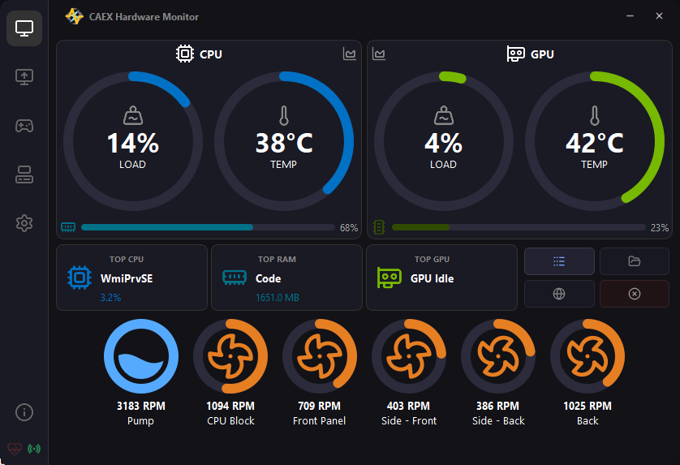

# CAEX Hardware Monitor 🚀

**CAEX** is a lightweight, high-performance hardware monitoring utility for Windows. Designed for gamers that don't want a wall of text, CAEX bridges the gap between raw data and stylish design.

 

## ✨ Key Features

- **Real-Time Dashboards:** High-refresh monitoring of CPU, GPU, and RAM.
- **Top Process Intelligence:** Instant visibility into which apps are hogging your resources.
- **Remote Monitoring:** Built-in support for LibreHardwareMonitor Remote web-server data.
- **Game Session Tab:** Tab for Monitoring current game session with session timer and usage.
- **Power User Toolkit:** Quick-access actions to kill stubborn processes, open file locations, or search for mysterious system tasks.
- **Ultra-Lightweight:** Compiled with Nuitka for native performance and a tiny memory footprint.

  

  <em>The CAEX Main Monitor showing intervaled CPU, GPU, and RAM stats.</em>

## 🛠 Installation & Setup

### General Setup
1. Download the latest `CAEX_Setup.exe` from the [Releases](../../releases) tab.
2. Run the installer (Administrator privileges are required for hardware sensor access).

### 🌐 Remote Monitoring Setup
If you want to pull data from a remote machine or view CAEX data on another device:
1. Ensure the host machine is running **LibreHardwareMonitor** with the **Remote Web Server** enabled (usually Port 8085).
2. In the CAEX **Settings** tab, navigate to the **Network/Remote** section.
3. Enter the `IP Address` and `Port` of the host machine.
4. Click "Connect", and CAEX will now bridge the data to your local dashboard.

## 🔒 Privacy & Security

CAEX is distributed as a compiled binary. It does **not** collect, phone home, or sell your hardware data. All monitoring happens locally on your machine.

---
*Developed by Skyrox*
